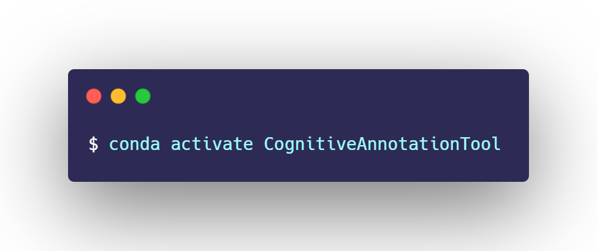
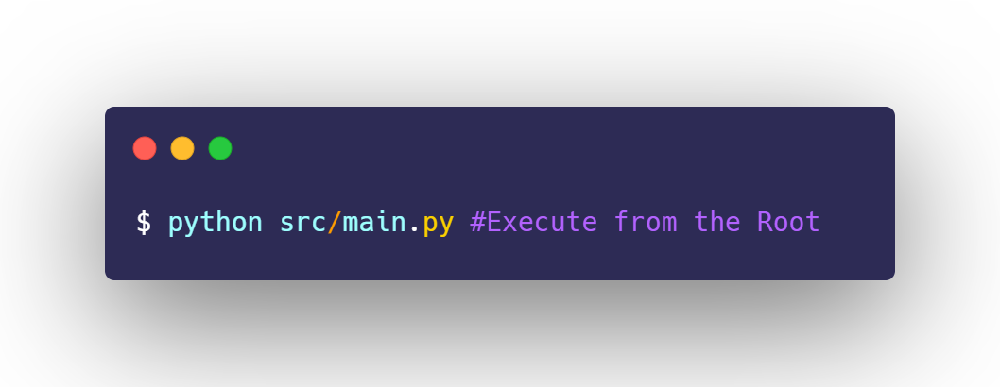

## Demo Video
<a href="https://youtu.be/T67T9KhiwFU"> Link </a>

## Cognitive Annotation Tool
#### About the Software 
* An opensource annotation tool aimed to help researchers get rid of annotating images manually for computer vision tasks like object detection and object localisation using the webcam feed. 
* The Tool creates annotation of images in <a href="http://host.robots.ox.ac.uk/pascal/VOC/"> Pascal VOC </a> format as .xml files corresponding to each image. The tool also generates annotations as csv file.
* The generated annotations are compatible for training machine learning/deep learning models using <a href="https://github.com/davisking/dlib"> Dlib- C++ </a> machine learning library or <a href="https://arxiv.org/abs/1708.02002"> Retinanet </a> based object detection models easily for custom object detection. For training retina-net based model, The user can refer to this <a href="https://github.com/fizyr/keras-retinanet">Github Repo. </a> 
* The Images and its corresponding annotation XML files are saved in the folder named entered by user in the GUI prompt during the initialisation of the software. 
* If the user wants to train a multi-stage object detector like Fast RCNN/Faster RCNN/Retinanet model for custom object detection then this jupyter notebook can be used to convert the Pascal VOC Annotation xml file(s).
* The software is capable of annotating bulk of images needed to create high quality custom machine learning/deep learning based object detectors from scratch or via Transfer learning.
* This tool can act as an automated version of <a href="https://imglab.in/"> ImgLab </a>

## Windows Executable
<a href=""> Download Link </a> :: Coming soon.

## Build from Source

### Prerequisite
1. Anaconda/Miniconda installed on Windows/Linux platform (Last checked to work on Windows 10)
2. Integrated webcam(preferably) or an external webcam, check this via ```$ python webcam_test.py```

#### Environment Configuration
1. Create a new environment using the <a href="https://github.com/Suraj520/CognitiveAnnotationTool/blob/master/environment.yml"> environment.yml </a>


2. Activate the environment using the following command

   
#### Launch the GUI Annotation Tool

Upon successful execution of the script, A GUI should appear as depicted below.


#### Instructions to follow to annotate custom images using GUI.

Once the GUI of the Software appears. Follow these steps to get started with the annotation.


#### Remarks:


#### Extra Notes.

###### 1. Editing the annotation.xml file


###### A. CSV generator
* <a href="https://github.com/Suraj520/CognitiveAnnotationTool/tree/master/notebooks/CSVAnnotationGenerator.ipynb "> XML to CSV Converter(Notebook)</a>
* <a href="https://github.com/Suraj520/CognitiveAnnotationTool/blob/master/src/CSVAnnotationGenerator.py"> XML to CSV Converter</a>


###### B. Pascal VOC XML generator
Coming soon: With TFOD Compatibility(Tensorflow Object detection toolbox).
```
After you execute main.py, you should be getting a core xml file which you can easily split into multiple xml files using few lines of code. Neverthless, I will try to upload the helper script soon :)
```

###### C. Yolo versions compatible Annotation generator
Coming soon:
```
After you execute main.py, you should be getting a core xml file which you can easily split into multiple xml files using few lines of code. Neverthless, I will try to upload the helper script soon :)
```

###### D. DLIB DNN-MOD/HOG+SVM COMPATIBLE
<a href="http://dlib.net/dnn_mmod_ex.cpp.html"> Dlib DNN_MMOD</a>
<a href="https://github.com/davisking/dlib/blob/master/python_examples/train_object_detector.py"> Dlib HOG+SVM </a>


###### 2. Steps to follow to get best results from the software


#### Python Library on PyPi
```Coming soon!```

## License

This project is licensed under the LGPLv3.0 License - see the [LICENSE.md](LICENSE.md) file for details


### Citation
If you find the tool helpful, please cite my paper.
```My name is not in BibTex file(though I am the first author) due to Google Scholar not being able to parse mononymous names :( ```
```
@inproceedings{kool2018visual,
  title={Visual machine intelligence for home automation},
  author={Kool, Ish and Kumar, Dharmendra and Barma, Shovan and others},
  booktitle={2018 3rd International Conference on Internet of Things: Smart Innovation and Usages (IoT-SIU)},
  pages={1--6},
  year={2018},
  organization={IEEE}
}
```
### Restrictions of usage
Strictly for Research purposes!
For commercial usages, obtain a license [](mailto:hrishabhsuraj52@gmail.com)
